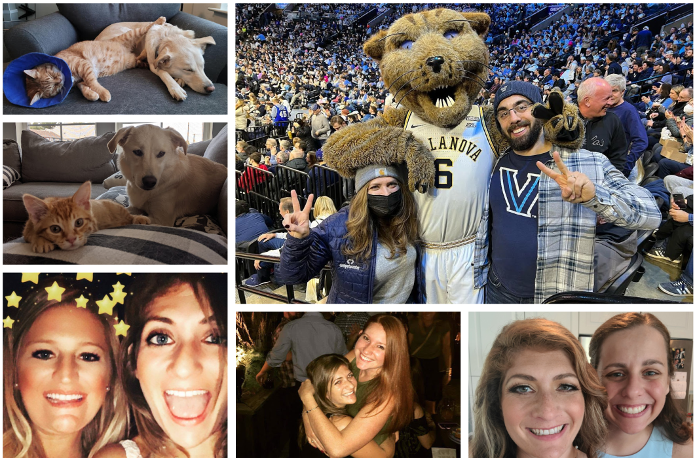
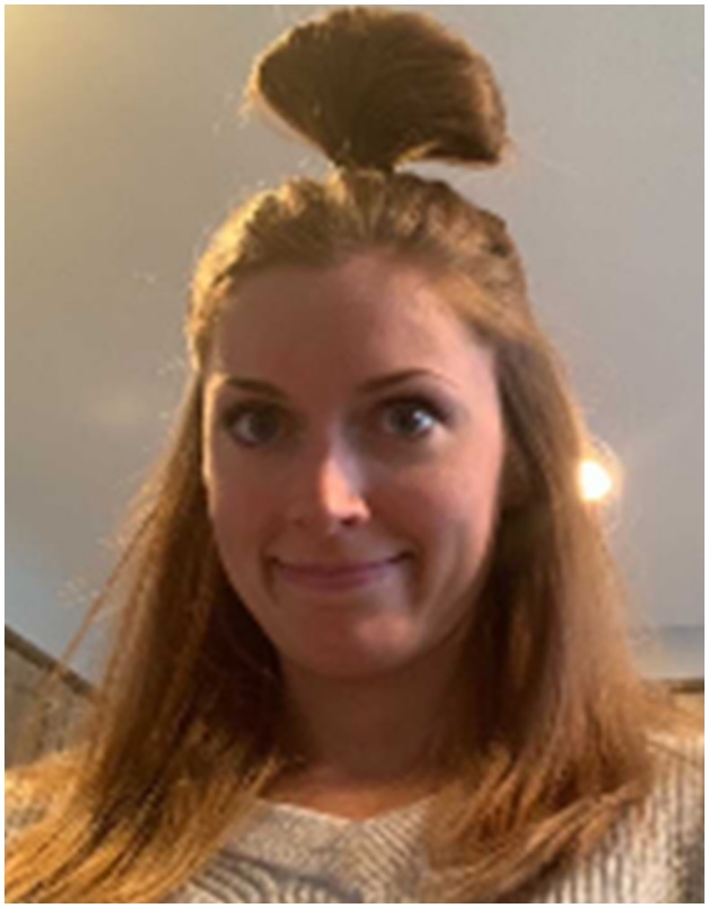
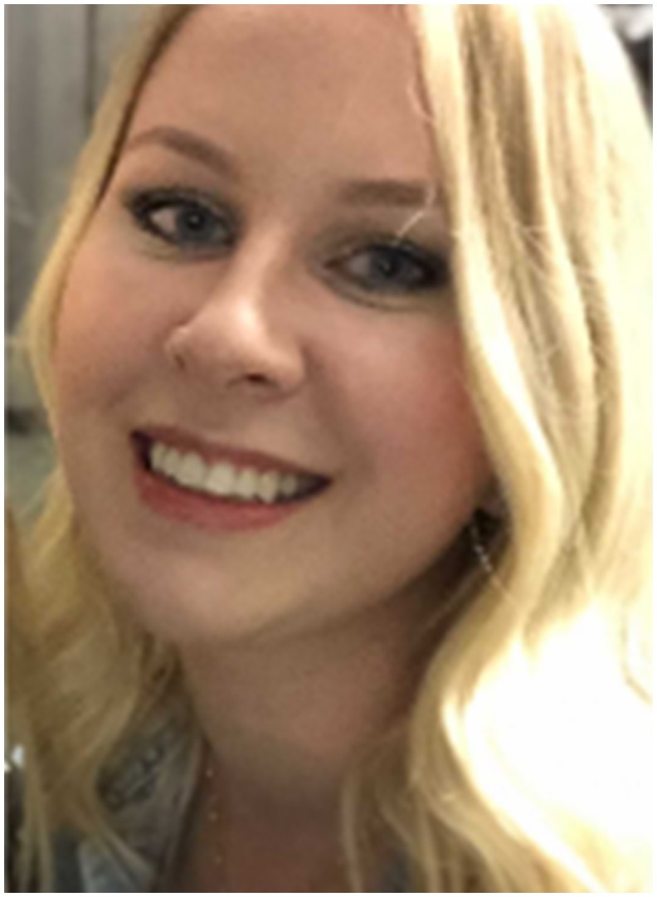
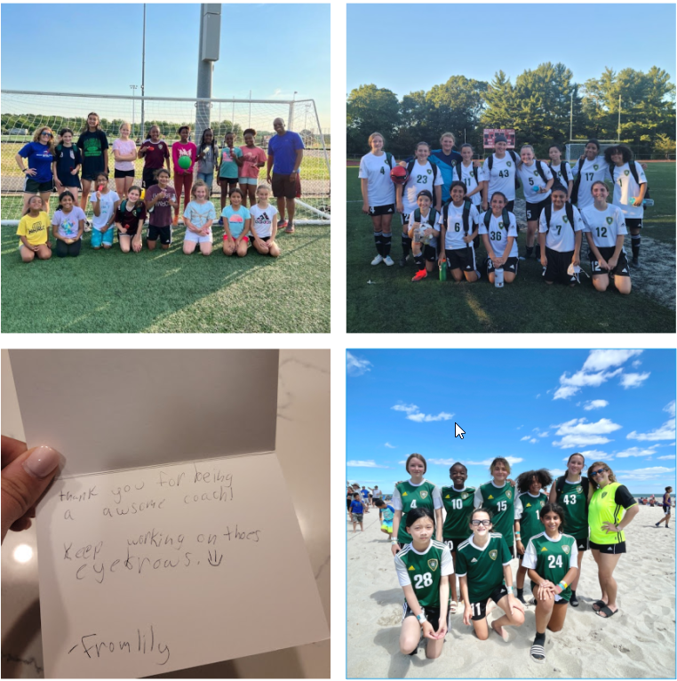
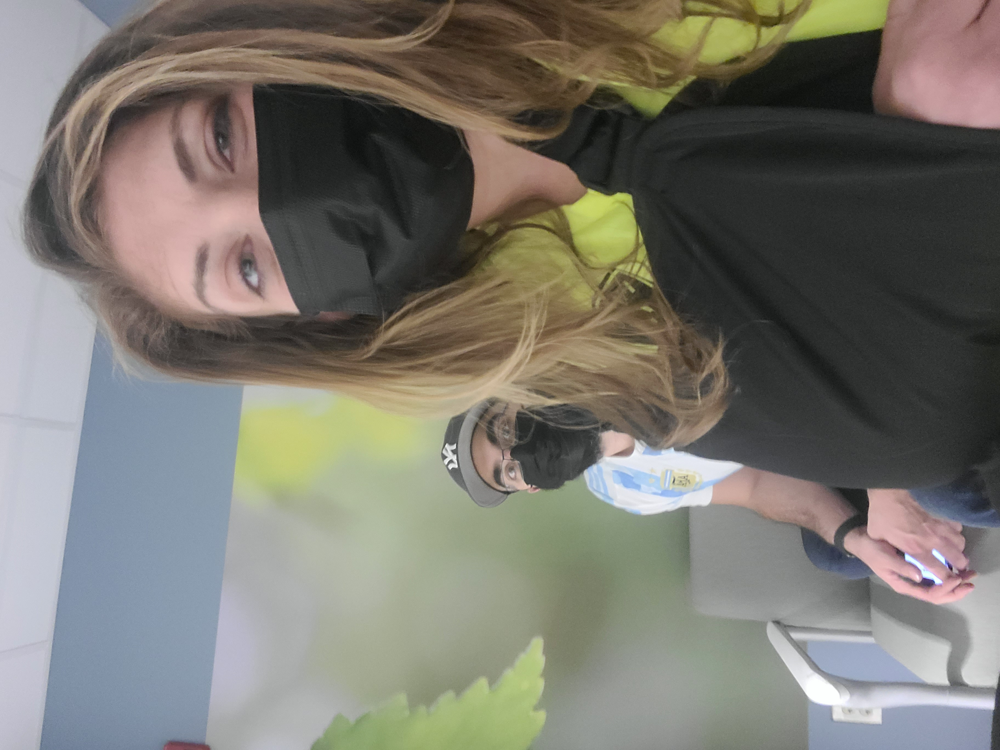

# Personal Presentation

 

Randi Sperling
Service Delivery Manager

 

**Digital Innovation Kickoff**
Virgin Hotel 
Las Vegas, Nevada
June 20, 2022 - June 23, 2022

---

<!-- footer: Computacenter 2022 -->
<!-- paginate: true -->

# **What Drives You and Why?**

---

---

- Whatever the business requires...!
    - Relationship Building and Account Ownership
    - Responsiveness
    - Escalation Path
    - Data Analysis
        - Quarterly Business Reviews (QBR)
            - Present KPI's to customers
- Bridge communication between customers, vendors, and engineering team
 

---

# Opportunities and Challenges
 
 
 

# 

---
# Professional Accomplishments

**Built a reliable and productive service delivery team**

_"It's not about the wins or losses; the purpose is to help your players be the best versions of themselves on and off the field. Leadership is about the long-game, not the short-term wins. Invest in unlocking the potential of people, and the results will follow."_ 
-- Ted Lasso

---
# Personal Investments
 
 
 
 
 
 
 
 
 
 

---

# Business Value
 
 

- Service Delivery Management Team
- Random, yet important knowledge

---

# What Went Well Retrospective

### What Went Well
- Service Delivery Management Team Growth

### What Did Not Go So Well...
- ERP Migration
- Scope Creep (specific contracts)

### What Would I Do Differently?
- Act early and issue change requests before the work occurs
- Communication

---

# Personal/Professional Investments for 2022/2023
- Pass the torch
    - Transition Planning
- Invest more time with finance and understanding our accounting processes
- PMP (Keeping It)
- Fractured Elbow? 
    - No, but partially torn LUCL and UCL
    - REHAB, REHAB, REHAB
