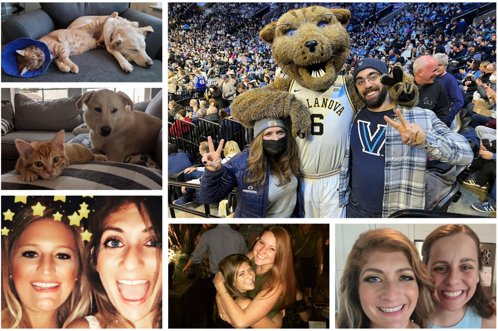

# Personal Presentation

 

Randi Sperling
Service Delivery Manager

 

**Digital Innovation Kickoff**
Virgin Hotel 
Las Vegas, Nevada
June 20, 2022 - June 23, 2022

---

<!-- footer: Computacenter 2022 -->
<!-- paginate: true -->

# **What Drives You and Why?**

---

---

- Relationship Building and Account Ownership
- Responsiveness
- Escalation Path
- Data Analysis
    -Quarterly Business Reviews (QBR)
        - Present KPI's to customers
- Bridge communication between customers, vendors, and engineering team
 

---

# Opportunities and Challenges
 
 
 

# bullet list

- bullet one
- bullet two
- bullet three

---
# Professional Accomplishments

- Built a reliable and productive service delivery team
- bullet two
- bullet three

---
# Personal Investments
 
 
 
 
 
 
 
 
 
 

---

# Business Value
 
 

- Service Delivery Management Team
    - Redistributed SDM workload
- Helped to analyze our business and apply a standard allocation across all contracts

---

# What Went Well Retrospective
 

- Service Delivery Management Team  
- ERP migration
- Knowledge transfer and training

---

# 2022-2023 Planning
 
 
 
 
 
 
 
 
 
 
 